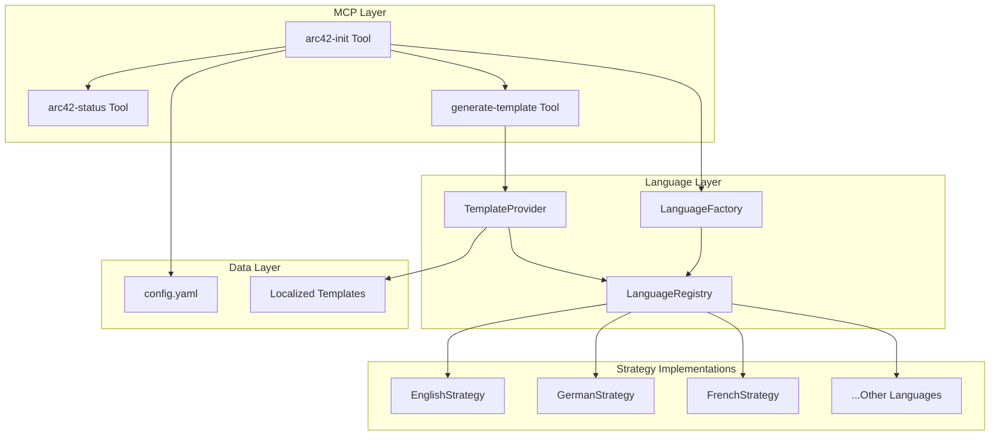
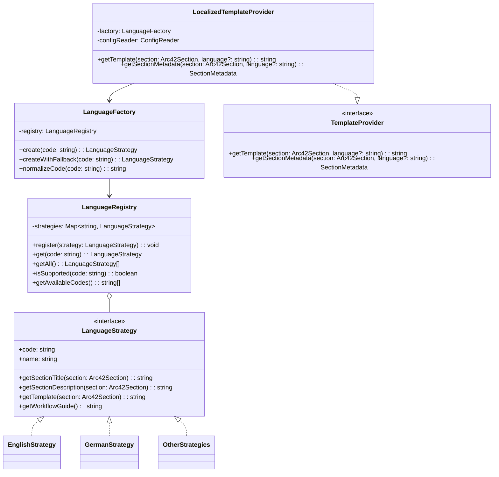

# Design Document: Multi-Language Template Support

## Overview

This design document describes the technical implementation of multi-language support for the Arc42 Node MCP Server. The feature enables users to generate and manage architecture documentation in any of the 11 languages supported by the official arc42 template repository.

The implementation uses established design patterns (Strategy, Factory, Registry, Provider) to ensure maintainability, testability, and extensibility, allowing new languages to be added without modifying core code.

## Steering Document Alignment

### Technical Standards (tech.md)

- **TypeScript 5.7**: All new code will be written in TypeScript with strict type checking
- **ES Modules**: Use ESM with `.js` extensions in imports
- **Zod Validation**: Language code parameters will be validated using Zod schemas
- **MCP SDK**: Tool parameter schemas will be extended to include `language` option
- **File-based Storage**: Language templates stored as TypeScript modules (no external files at runtime)

### Project Structure (structure.md)

Following the established patterns:
- **kebab-case** file naming: `language-strategy.ts`, `template-provider.ts`
- **PascalCase** for types/interfaces: `LanguageStrategy`, `LanguageRegistry`
- **Tool Handler Pattern**: Extend existing handlers with language-aware logic
- **Barrel exports** via `index.ts` for clean imports

### S.O.L.I.D Principles Alignment (tech.md)

This design adheres to S.O.L.I.D principles as defined in tech.md:

| Principle | Application in This Design |
|-----------|---------------------------|
| **SRP** | `LanguageRegistry` only manages registration; `LanguageFactory` only creates instances; `TemplateProvider` only retrieves templates |
| **OCP** | New languages added by implementing `LanguageStrategy` without modifying existing code |
| **LSP** | All language strategies (German, French, etc.) are substitutable wherever `LanguageStrategy` is expected |
| **ISP** | Separate interfaces: `LanguageStrategy` (language content), `TemplateProvider` (template access), `LanguageInfo` (metadata) |
| **DIP** | Tool handlers depend on `TemplateProvider` interface, not `LocalizedTemplateProvider` concrete class |

### Design Patterns Alignment (tech.md)

Following the design patterns from tech.md:

| Pattern | Component | Benefit |
|---------|-----------|---------|
| **Strategy** | `LanguageStrategy` interface + implementations | Add languages without modifying existing code |
| **Factory** | `LanguageFactory` | Centralized creation with normalization and fallback |
| **Registry** | `LanguageRegistry` | Single source of truth, runtime discovery |
| **Facade** | `LocalizedTemplateProvider` | Simplifies language/config complexity for tool handlers |
| **Singleton** | Module-level instances | Global access to registry, factory, provider |

### TDD Alignment (tech.md)

Implementation SHALL follow TDD practices:
- **Test First**: Write failing tests for each component before implementation
- **AAA Pattern**: Use Arrange-Act-Assert structure in all tests
- **Coverage Targets**: Aim for 85% coverage (minimum 70%)
- **Isolation**: Mock dependencies for unit tests

## Code Reuse Analysis

### Existing Components to Leverage

- **`src/types.ts`**: Extend with language-related types and constants
- **`src/templates/index.ts`**: Current English templates as base for localization
- **`src/tools/arc42-init.ts`**: Extend to accept `language` parameter
- **`src/tools/generate-template.ts`**: Extend to read project language config
- **`src/tools/arc42-status.ts`**: Extend to display configured language
- **`resolveWorkspaceRoot()`**: Reuse for config file path resolution

### Integration Points

- **config.yaml**: Add `language` field to persist user preference
- **MCP Tool Registration**: Add `language` parameter to tool schemas in `server.ts`
- **Existing Templates**: Refactor English templates to be language-strategy implementation

## Architecture

### High-Level Architecture



### Design Pattern Implementation



## Components and Interfaces

### Component 1: LanguageStrategy Interface

**File:** `src/templates/locales/language-strategy.ts`

- **Purpose:** Defines the contract for all language implementations
- **Interfaces:**
  ```typescript
  interface LanguageStrategy {
    readonly code: string;           // e.g., "DE", "EN"
    readonly name: string;           // e.g., "German", "English"
    readonly nativeName: string;     // e.g., "Deutsch", "English"
    
    getSectionTitle(section: Arc42Section): string;
    getSectionDescription(section: Arc42Section): string;
    getTemplate(section: Arc42Section): string;
    getWorkflowGuide(): string;
    getReadmeContent(projectName: string): string;
  }
  ```
- **Dependencies:** `Arc42Section` from `types.ts`
- **Reuses:** Section enumeration from existing types

### Component 2: LanguageRegistry

**File:** `src/templates/locales/language-registry.ts`

- **Purpose:** Maintains catalog of all available languages, provides discovery and validation
- **Interfaces:**
  ```typescript
  class LanguageRegistry {
    register(strategy: LanguageStrategy): void;
    get(code: string): LanguageStrategy | undefined;
    getOrThrow(code: string): LanguageStrategy;
    getAll(): LanguageStrategy[];
    isSupported(code: string): boolean;
    getAvailableCodes(): string[];
    getDefault(): LanguageStrategy;
  }
  ```
- **Dependencies:** `LanguageStrategy`
- **Reuses:** None (new component)

### Component 3: LanguageFactory

**File:** `src/templates/locales/language-factory.ts`

- **Purpose:** Creates language strategy instances with normalization and fallback logic
- **Interfaces:**
  ```typescript
  class LanguageFactory {
    constructor(registry: LanguageRegistry);
    create(code: string): LanguageStrategy;
    createWithFallback(code: string): LanguageStrategy;
    normalizeCode(code: string): string;
  }
  ```
- **Dependencies:** `LanguageRegistry`
- **Reuses:** None (new component)

### Component 4: LocalizedTemplateProvider

**File:** `src/templates/locales/template-provider.ts`

- **Purpose:** Provides language-aware template access with config integration
- **Interfaces:**
  ```typescript
  interface TemplateProvider {
    getTemplate(section: Arc42Section, language?: string): string;
    getSectionMetadata(section: Arc42Section, language?: string): LocalizedSectionMetadata;
    getAvailableLanguages(): LanguageInfo[];
  }
  
  class LocalizedTemplateProvider implements TemplateProvider {
    constructor(factory: LanguageFactory);
    getTemplate(section: Arc42Section, language?: string): string;
    getSectionMetadata(section: Arc42Section, language?: string): LocalizedSectionMetadata;
    getAvailableLanguages(): LanguageInfo[];
  }
  ```
- **Dependencies:** `LanguageFactory`, `ConfigReader`
- **Reuses:** Existing config.yaml reading logic

### Component 5: Language Strategy Implementations

**Files:** `src/templates/locales/{code}/index.ts` (one per language)

- **Purpose:** Concrete implementations for each supported language
- **Structure per language:**
  ```
  src/templates/locales/
  ├── en/
  │   ├── index.ts          # EnglishStrategy export
  │   ├── sections.ts       # Section titles and descriptions
  │   └── templates.ts      # Full template content
  ├── de/
  │   ├── index.ts          # GermanStrategy export
  │   ├── sections.ts
  │   └── templates.ts
  └── [11 language folders]
  ```
- **Reuses:** Existing English templates refactored into this structure

## Data Models

### LanguageInfo

```typescript
interface LanguageInfo {
  code: string;           // "EN", "DE", etc.
  name: string;           // "English", "German"
  nativeName: string;     // "English", "Deutsch"
}
```

### LocalizedSectionMetadata

```typescript
interface LocalizedSectionMetadata {
  name: string;           // Section filename (unchanged)
  title: string;          // Localized title
  description: string;    // Localized description
  order: number;          // Section order (unchanged)
}
```

### Extended Config.yaml

```yaml
project:
  name: "My Project"
  version: "1.0.0"
  language: "DE"          # NEW: Language setting
  created: "2026-02-12"
```

### Extended Tool Parameters

```typescript
// arc42-init extended schema
{
  projectName: z.string(),
  force: z.boolean().optional(),
  targetFolder: z.string().optional(),
  language: z.string().optional()  // NEW
}

// generate-template extended schema
{
  section: z.enum(ARC42_SECTIONS),
  language: z.string().optional()  // NEW
}
```

## File Structure

```
src/
├── templates/
│   ├── index.ts                    # Re-export LocalizedTemplateProvider
│   ├── arc42-reference.ts          # Version info (unchanged)
│   └── locales/
│       ├── index.ts                # Registry, Factory, Provider exports
│       ├── language-strategy.ts    # Interface definition
│       ├── language-registry.ts    # Registry implementation
│       ├── language-factory.ts     # Factory implementation
│       ├── template-provider.ts    # Provider implementation
│       ├── en/
│       │   ├── index.ts            # Export EnglishStrategy
│       │   ├── sections.ts         # Section metadata
│       │   └── templates.ts        # Template content
│       ├── cz/
│       │   └── [same structure]
│       ├── de/
│       │   └── [same structure]
│       ├── es/
│       │   └── [same structure]
│       ├── fr/
│       │   └── [same structure]
│       ├── it/
│       │   └── [same structure]
│       ├── nl/
│       │   └── [same structure]
│       ├── pt/
│       │   └── [same structure]
│       ├── ru/
│       │   └── [same structure]
│       ├── ukr/
│       │   └── [same structure]
│       └── zh/
│           └── [same structure]
├── tools/
│   ├── arc42-init.ts              # Modified: add language parameter
│   ├── arc42-status.ts            # Modified: display language
│   └── generate-template.ts       # Modified: language-aware
└── types.ts                       # Extended with language types
```

## Error Handling

### Error Scenarios

1. **Unsupported Language Code**
   - **Handling:** Return error with list of valid codes
   - **User Impact:** Clear message: "Unsupported language 'XX'. Available: EN, CZ, DE, ES, FR, IT, NL, PT, RU, UKR, ZH"

2. **Missing Template Content**
   - **Handling:** Fall back to English with warning in response
   - **User Impact:** Template generated in English with note: "Template not available in 'XX', using English fallback"

3. **Corrupted config.yaml Language**
   - **Handling:** Ignore invalid value, use English default
   - **User Impact:** Silent fallback, status shows "EN (default)"

4. **Case Mismatch in Language Code**
   - **Handling:** Normalize to uppercase automatically
   - **User Impact:** Transparent - "de" treated same as "DE"

## Testing Strategy

### Unit Testing

**Files:** `src/__tests__/templates/locales/*.test.ts`

- Test `LanguageRegistry`:
  - Registration of strategies
  - Lookup by code (case-insensitive)
  - `isSupported()` validation
  - `getAll()` returns all registered

- Test `LanguageFactory`:
  - Code normalization (case handling)
  - Fallback to English for unknown codes
  - Creation of correct strategy type

- Test `LocalizedTemplateProvider`:
  - Returns correct template for language
  - Config override by parameter
  - Fallback behavior

- Test each `LanguageStrategy`:
  - All 12 sections have titles
  - All 12 sections have descriptions
  - Templates contain valid markdown

### Integration Testing

**Files:** `src/__tests__/tools/*.test.ts` (extend existing)

- Test `arc42-init` with language:
  - Creates files with localized content
  - Saves language to config.yaml
  - Defaults to EN when not specified

- Test `generate-template` with language:
  - Reads language from config
  - Parameter overrides config
  - Works for all 11 languages

- Test `arc42-status` with language:
  - Displays configured language
  - Shows "EN (default)" when not set

### End-to-End Testing

- Initialize project in German → verify all files German
- Initialize project in Chinese → verify Chinese content
- Initialize without language → verify English default
- Change language mid-project via parameter override
