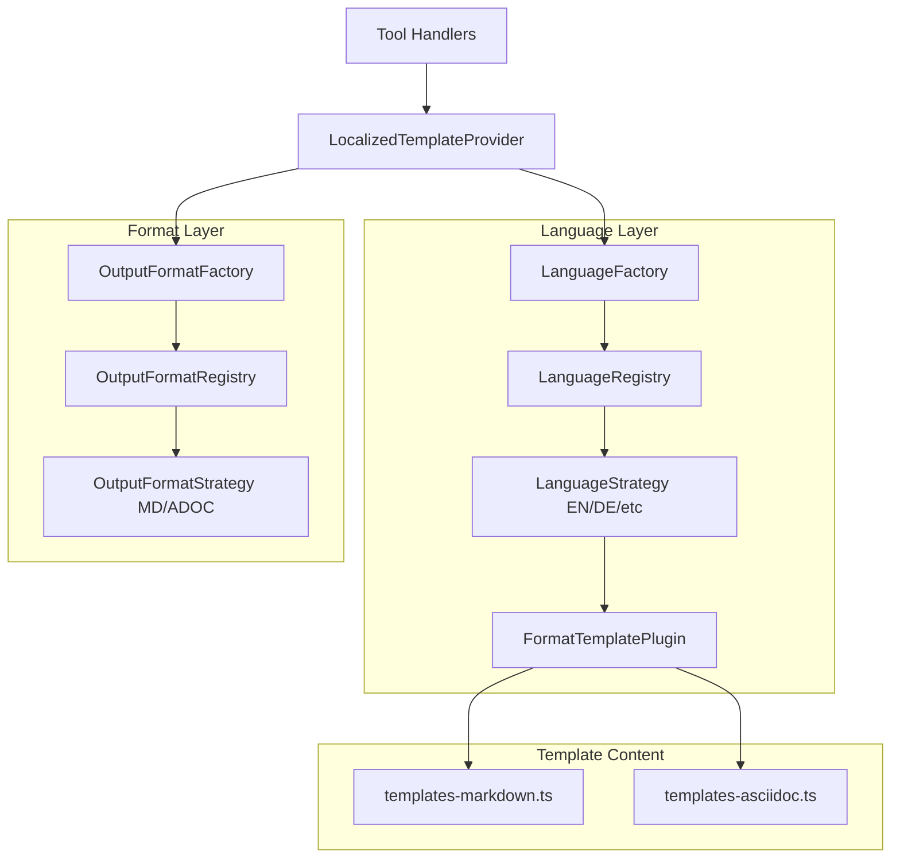
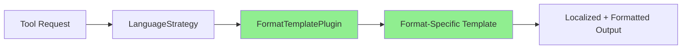

# Design Document: Multiple Output Formats

## Overview

This design document describes the architecture for adding multiple output format support to the Arc42 Node MCP Server. The implementation follows the same Strategy Pattern used by the multi-language feature, providing a pluggable architecture for format handling. The initial implementation adds AsciiDoc format support alongside the existing Markdown functionality, with AsciiDoc as the default format for new projects.

## Steering Document Alignment

### Technical Standards (tech.md)

The design follows these documented patterns and standards:

- **Strategy Pattern**: Output format strategies follow the same pattern as `LanguageStrategy` implementation
- **Registry Pattern**: `OutputFormatRegistry` matches `LanguageRegistry` for centralized format management
- **Factory Pattern**: `OutputFormatFactory` matches `LanguageFactory` for format creation with normalization
- **Facade Pattern**: The template provider will facade format complexity for tools
- **S.O.L.I.D Principles**: Each component follows SRP, OCP, LSP, ISP, and DIP
- **DRY Principle**: Format constants and common logic defined once

### Project Structure (structure.md)

The implementation follows project organization conventions:

```
src/templates/
├── locales/                            # Language support with format plugins
│   ├── language-strategy.ts            # Updated LanguageStrategy interface
│   ├── language-strategy-factory.ts    # NEW: Plugin-based strategy factory
│   ├── template-provider.ts            # Extended with format support
│   ├── en/
│   │   ├── index.ts                    # English strategy with format plugins
│   │   ├── sections.ts                 # Section titles/descriptions
│   │   ├── templates-markdown.ts       # Markdown templates
│   │   └── templates-asciidoc.ts       # NEW: AsciiDoc templates
│   ├── de/
│   │   ├── index.ts                    # German strategy with format plugins
│   │   ├── sections.ts
│   │   ├── templates-markdown.ts
│   │   └── templates-asciidoc.ts       # NEW: Native AsciiDoc templates
│   └── [cz|es|fr|it|nl|pt|ru|ukr|zh]/  # All 11 languages with both formats
│       ├── index.ts
│       ├── sections.ts
│       ├── templates-markdown.ts
│       └── templates-asciidoc.ts       # NEW: Native AsciiDoc templates
└── formats/                            # Output format support
    ├── index.ts                        # Format barrel exports + utilities
    ├── output-format-strategy.ts       # OutputFormatStrategy interface
    ├── output-format-factory.ts        # Factory for creating strategies
    ├── output-format-registry.ts       # Registry for format strategies
    ├── markdown/
    │   └── index.ts                    # MarkdownFormatStrategy
    └── asciidoc/
        └── index.ts                    # AsciiDocFormatStrategy
```

## Code Reuse Analysis

### Existing Components to Leverage

- **LanguageStrategy pattern**: The same Strategy/Registry/Factory architecture will be adapted for formats
- **templateProvider**: Will be extended to use format strategies when generating content
- **types.ts utilities**: `getErrorMessage()`, `resolveWorkspaceRoot()` will be reused
- **config.yaml handling**: Existing YAML parsing infrastructure will include format settings

### Integration Points

- **arc42-init tool**: Will add `format` parameter, defaulting to "asciidoc"
- **generate-template tool**: Will respect configured format
- **update-section tool**: Will maintain existing file format
- **arc42-status tool**: Will detect both `.md` and `.adoc` extensions
- **LocalizedTemplateProvider**: Will compose with format strategies

## Architecture

The design adds a format layer that transforms language-agnostic content into format-specific output. The implementation uses a **plugin-based architecture** where each language strategy provides format-specific template plugins, enabling native templates for each language-format combination.

### Modular Design Principles

- **Single File Responsibility**: Each format strategy handles one format's syntax
- **Component Isolation**: Format strategies are independent of each other
- **Service Layer Separation**: Format strategies only handle syntax, not content
- **Utility Modularity**: Format utilities are focused and single-purpose
- **Plugin Architecture**: Language strategies use pluggable format providers (FormatTemplatePlugin)
- **Native Templates**: Each language provides native AsciiDoc templates from vendor sources

### Architecture Diagram



### Content Flow



## Components and Interfaces

### Component 1: OutputFormatStrategy Interface

- **Purpose**: Defines the contract for all output format implementations
- **Interfaces**:
  ```typescript
  interface OutputFormatStrategy {
    // Metadata
    code: OutputFormatCode;      // 'markdown' | 'asciidoc'
    name: string;                // 'Markdown' | 'AsciiDoc'
    fileExtension: string;       // '.md' | '.adoc'

    // Syntax conversion
    formatHeading(text: string, level: number): string;
    formatBold(text: string): string;
    formatItalic(text: string): string;
    formatCode(code: string, language?: string): string;
    formatInlineCode(text: string): string;
    formatUnorderedList(items: string[]): string;
    formatOrderedList(items: string[]): string;
    formatLink(text: string, url: string): string;
    formatImage(alt: string, url: string): string;
    formatTable(headers: string[], rows: string[][]): string;
    formatBlockquote(text: string): string;
    formatHorizontalRule(): string;
    formatAnchor(id: string): string;

    // File generation
    getReadmeFilename(): string;       // 'README.md' | 'README.adoc'
    getSectionFilename(section: string): string;
  }
  ```
- **Dependencies**: None (pure interface)
- **Reuses**: Pattern from `LanguageStrategy` interface

### Component 2: OutputFormatRegistry

- **Purpose**: Stores and retrieves format strategies with O(1) lookup
- **Interfaces**:
  ```typescript
  class OutputFormatRegistry {
    register(strategy: OutputFormatStrategy): this;
    get(code: string): OutputFormatStrategy | undefined;
    getOrThrow(code: string): OutputFormatStrategy;
    getAll(): OutputFormatStrategy[];
    isSupported(code: string): boolean;
    getAvailableCodes(): OutputFormatCode[];
    getDefault(): OutputFormatStrategy | undefined;
    get size(): number;
    clear(): this;
  }
  ```
- **Dependencies**: `OutputFormatStrategy` interface
- **Reuses**: Implementation pattern from `LanguageRegistry`

### Component 3: OutputFormatFactory

- **Purpose**: Creates format strategy instances with normalization and fallback
- **Interfaces**:
  ```typescript
  class OutputFormatFactory {
    constructor(registry: OutputFormatRegistry);
    normalizeCode(code: string): string;
    create(code: string): OutputFormatStrategy;
    createWithFallback(code: string): OutputFormatStrategy;  // Falls back to AsciiDoc
    isSupported(code: string): boolean;
    getAvailableCodes(): OutputFormatCode[];
    getDefault(): OutputFormatStrategy;  // Returns AsciiDoc
  }
  ```
- **Dependencies**: `OutputFormatRegistry`
- **Reuses**: Implementation pattern from `LanguageFactory`

### Component 4: MarkdownFormatStrategy

- **Purpose**: Implements Markdown-specific formatting syntax
- **Interfaces**: Implements `OutputFormatStrategy`
- **Dependencies**: `OutputFormatStrategy` interface
- **Key Syntax**:
  - Headings: `#`, `##`, `###`, etc.
  - Bold: `**text**`
  - Italic: `*text*`
  - Code blocks: ` ```language `
  - Lists: `-` for unordered, `1.` for ordered
  - File extension: `.md`

### Component 5: AsciiDocFormatStrategy

- **Purpose**: Implements AsciiDoc-specific formatting syntax
- **Interfaces**: Implements `OutputFormatStrategy`
- **Dependencies**: `OutputFormatStrategy` interface
- **Key Syntax**:
  - Headings: `=`, `==`, `===`, etc.
  - Bold: `*text*`
  - Italic: `_text_`
  - Code blocks: `[source,language]` + `----`
  - Lists: `*` for unordered, `.` for ordered
  - File extension: `.adoc`
  - Anchors: `[[id]]`

### Component 6: Extended LocalizedTemplateProvider

- **Purpose**: Provides unified access to localized and formatted templates
- **Interfaces**:
  ```typescript
  class LocalizedTemplateProvider {
    // Existing methods...

    // New format-aware methods
    getTemplateForFormat(section: Arc42Section, language?: string, format?: OutputFormatCode): string;
    getWorkflowGuideForFormat(language?: string, format?: OutputFormatCode): string;
    getReadmeContentForFormat(language?: string, format?: OutputFormatCode, projectName?: string): string;
    readFormatFromConfig(workspacePath: string): OutputFormatCode | undefined;
    readLanguageFromConfig(workspacePath: string): string | undefined;
  }
  ```
- **Dependencies**: `LanguageFactory`, `OutputFormatFactory`
- **Reuses**: Extends existing `LocalizedTemplateProvider`

### Component 7: FormatTemplatePlugin Interface (NEW)

- **Purpose**: Plugin interface for format-specific template providers, enabling DRY language strategies
- **Interfaces**:
  ```typescript
  interface FormatTemplatePlugin {
    /** Get template for a specific section */
    getTemplate(section: Arc42Section): string;
    /** Get workflow guide content */
    getWorkflowGuide(): string;
    /** Get README content */
    getReadmeContent(projectName?: string): string;
  }
  ```
- **Dependencies**: None (pure interface)
- **Usage**: Implemented by each language's `templates-markdown.ts` and `templates-asciidoc.ts`

### Component 8: Language Strategy Factory (NEW)

- **Purpose**: Factory for creating language strategies with pluggable format support
- **Interfaces**:
  ```typescript
  interface LanguageStrategyConfig {
    code: LanguageCode;
    name: string;
    nativeName: string;
    getSectionTitle: (section: Arc42Section) => string;
    getSectionDescription: (section: Arc42Section) => string;
    formatPlugins: Record<OutputFormatCode, FormatTemplatePlugin>;
  }

  function createLanguageStrategy(config: LanguageStrategyConfig): LanguageStrategy;
  function createFormatPlugin(
    getTemplate: (section: Arc42Section) => string,
    getWorkflowGuide: () => string,
    getReadmeContent: (projectName?: string) => string
  ): FormatTemplatePlugin;
  function createFormatPluginsWithFallback(
    primaryPlugins: Partial<Record<OutputFormatCode, FormatTemplatePlugin>>,
    fallbackPlugins: Record<OutputFormatCode, FormatTemplatePlugin>
  ): Record<OutputFormatCode, FormatTemplatePlugin>;
  ```
- **Dependencies**: `LanguageStrategy`, `FormatTemplatePlugin`, `OutputFormatCode`
- **Location**: `src/templates/locales/language-strategy-factory.ts`

### Component 9: Updated LanguageStrategy Interface (MODIFIED)

- **Purpose**: Extended to support format-aware template retrieval
- **Interfaces**:
  ```typescript
  interface LanguageStrategy extends LanguageInfo {
    getSectionTitle(section: Arc42Section): SectionTitle;
    getSectionDescription(section: Arc42Section): SectionDescription;

    // NEW: Format-aware methods (replace old getTemplate, getWorkflowGuide, getReadmeContent)
    getTemplateForFormat(section: Arc42Section, format: OutputFormatCode): string;
    getWorkflowGuideForFormat(format: OutputFormatCode): string;
    getReadmeContentForFormat(projectName: string | undefined, format: OutputFormatCode): string;
  }
  ```
- **Dependencies**: `OutputFormatCode`
- **Breaking Change**: Old methods (`getTemplate`, `getWorkflowGuide`, `getReadmeContent`) replaced with format-aware versions

### Component 10: Format Utility Functions (NEW)

- **Purpose**: Convenience functions for format detection and strategy access
- **Interfaces**:
  ```typescript
  // In src/templates/formats/index.ts
  function getOutputFormatStrategy(code: string): OutputFormatStrategy;
  function getOutputFormatStrategyWithFallback(code: string): OutputFormatStrategy;
  function getDefaultOutputFormatStrategy(): OutputFormatStrategy;
  function isOutputFormatSupported(code: string): boolean;
  function getSupportedOutputFormatCodes(): OutputFormatCode[];
  function detectOutputFormatFromExtension(extension: string): OutputFormatCode | undefined;
  function detectOutputFormatFromFilename(filename: string): OutputFormatCode | undefined;
  ```
- **Dependencies**: `outputFormatFactory` singleton
- **Usage**: Used by tools to detect and work with file formats

## Data Models

### OutputFormatCode Type

```typescript
type OutputFormatCode = 'markdown' | 'asciidoc';

const SUPPORTED_OUTPUT_FORMAT_CODES: readonly OutputFormatCode[] =
  ['markdown', 'asciidoc'] as const;

// Aliases for normalization
const OUTPUT_FORMAT_ALIASES: Record<string, OutputFormatCode> = {
  'md': 'markdown',
  'markdown': 'markdown',
  'adoc': 'asciidoc',
  'asciidoc': 'asciidoc',
  'ascii': 'asciidoc',
  'asciidoctor': 'asciidoc'
};

const DEFAULT_OUTPUT_FORMAT: OutputFormatCode = 'asciidoc';
```

### OutputFormatInfo Type

```typescript
interface OutputFormatInfo {
  code: OutputFormatCode;
  name: string;
  fileExtension: string;
}
```

### Updated config.yaml Structure

```yaml
projectName: My Project
version: 1.0.0
created: 2024-01-01T00:00:00.000Z
format: asciidoc          # NEW: Output format (default: asciidoc)
language: EN
arc42_template_version: 8.2
arc42_template_date: January 2023
arc42_template_commit: abc123
```

## Error Handling

### Error Scenarios

1. **Unknown Format Code**
   - **Handling**: Log warning, fall back to AsciiDoc
   - **User Impact**: System continues with default format, warning shown

2. **Invalid Format in Config**
   - **Handling**: Log warning, use AsciiDoc
   - **User Impact**: Documentation generated with default format

3. **Format Strategy Not Registered**
   - **Handling**: Throw descriptive error with available formats
   - **User Impact**: Clear error message listing valid options

4. **File Extension Mismatch**
   - **Handling**: Detect existing format from file extension
   - **User Impact**: Existing files maintain their format

## Testing Strategy

### Unit Testing

Each component will have dedicated unit tests:

- **OutputFormatStrategy tests**: Verify syntax generation for all methods
- **OutputFormatRegistry tests**: Verify registration, lookup, and enumeration
- **OutputFormatFactory tests**: Verify normalization, fallback, and creation
- **MarkdownFormatStrategy tests**: Verify all Markdown syntax conversions
- **AsciiDocFormatStrategy tests**: Verify all AsciiDoc syntax conversions

### Integration Testing

- Test `arc42-init` creates files in correct format
- Test `generate-template` produces format-specific output
- Test `arc42-status` detects both `.md` and `.adoc` files
- Test format switches mid-project work correctly

### Test File Structure

```
src/__tests__/templates/formats/
├── output-format-strategy.test.ts
├── output-format-registry.test.ts
├── output-format-factory.test.ts
├── markdown/
│   └── markdown-strategy.test.ts
└── asciidoc/
    └── asciidoc-strategy.test.ts
```

### Coverage Goals

| Metric | Target |
|--------|--------|
| Statements | 80% |
| Branches | 75% |
| Functions | 90% |
| Lines | 80% |

## Tool Parameter Updates

### arc42-init

```typescript
export const arc42InitInputSchema = {
  projectName: z.string().describe('Name of the project'),
  force: z.boolean().optional(),
  targetFolder: z.string().optional(),
  language: z.enum(languageValues).optional().default('EN'),
  format: z.enum(['markdown', 'asciidoc', 'md', 'adoc'])
    .optional()
    .default('asciidoc')  // NEW: Default to AsciiDoc
    .describe('Output format: markdown (md) or asciidoc (adoc). Defaults to asciidoc.')
};
```

### generate-template

```typescript
export const generateTemplateInputSchema = {
  section: z.enum(sectionValues),
  language: z.enum(languageValues).optional().default('EN'),
  targetFolder: z.string().optional(),
  format: z.enum(['markdown', 'asciidoc', 'md', 'adoc'])
    .optional()
    .describe('Output format. Defaults to config.yaml setting or asciidoc.')
};
```

## Implementation Notes

### Markdown Syntax Reference

| Element | Markdown Syntax |
|---------|----------------|
| H1 | `# Title` |
| H2 | `## Section` |
| Bold | `**bold**` |
| Italic | `*italic*` |
| Code | ` ```lang ` ... ` ``` ` |
| Inline code | `` `code` `` |
| Unordered list | `- item` |
| Ordered list | `1. item` |
| Link | `[text](url)` |
| Image | `` |
| Blockquote | `> quote` |
| HR | `---` |

### AsciiDoc Syntax Reference

| Element | AsciiDoc Syntax |
|---------|----------------|
| H1 | `= Title` |
| H2 | `== Section` |
| Bold | `*bold*` |
| Italic | `_italic_` |
| Code | `[source,lang]` + `----` |
| Inline code | `` `code` `` |
| Unordered list | `* item` |
| Ordered list | `. item` |
| Link | `link:url[text]` |
| Image | `image::url[alt]` |
| Blockquote | `____` block |
| HR | `'''` |
| Anchor | `[[id]]` |
| Cross-ref | `<<id>>` |

## Migration Considerations

### Existing Markdown Projects

Existing projects with `.md` files will continue to work:

1. Tools detect file extensions to determine format
2. No automatic migration of existing files
3. Users can manually convert if desired

### New Projects

New projects created with `arc42-init`:

1. Default to AsciiDoc format (`.adoc` files)
2. Users can explicitly request Markdown with `format: "markdown"`
3. Config.yaml stores the chosen format

## Native AsciiDoc Templates

### Template Sources

All 11 languages now have **native AsciiDoc templates** sourced directly from the official arc42 template repository:

| Language | Source Folder | templates-asciidoc.ts |
|----------|---------------|----------------------|
| EN (English) | `vendor/arc42-template/EN/asciidoc/` | Native |
| DE (German) | `vendor/arc42-template/DE/asciidoc/` | Native |
| CZ (Czech) | `vendor/arc42-template/CZ/asciidoc/` | Native |
| ES (Spanish) | `vendor/arc42-template/ES/asciidoc/` | Native |
| FR (French) | `vendor/arc42-template/FR/asciidoc/` | Native |
| IT (Italian) | `vendor/arc42-template/IT/asciidoc/` | Native |
| NL (Dutch) | `vendor/arc42-template/NL/asciidoc/` | Native |
| PT (Portuguese) | `vendor/arc42-template/PT/asciidoc/` | Native |
| RU (Russian) | `vendor/arc42-template/RU/asciidoc/` | Native |
| UKR (Ukrainian) | `vendor/arc42-template/UA/asciidoc/` | Native |
| ZH (Chinese) | `vendor/arc42-template/ZH/asciidoc/` | Native |

### Template File Structure

Each language module now contains:

```
src/templates/locales/{lang}/
├── index.ts              # Language strategy with format plugins
├── sections.ts           # Section titles and descriptions
├── templates-markdown.ts # Markdown templates (existing)
└── templates-asciidoc.ts # AsciiDoc templates (NEW - native)
```

### Plugin Registration

Each language's `index.ts` registers both format plugins:

```typescript
export const {lang}Strategy = createLanguageStrategy({
  code: '{LANG}',
  name: '{Language}',
  nativeName: '{NativeName}',
  getSectionTitle,
  getSectionDescription,
  formatPlugins: {
    markdown: {lang}MarkdownPlugin,
    asciidoc: {lang}AsciidocPlugin  // Native AsciiDoc templates
  }
});
```

## Future Extensibility

### Adding New Formats

To add a new format (e.g., reStructuredText):

1. Create `src/templates/formats/rst/index.ts`
2. Implement `OutputFormatStrategy` interface
3. Register in `src/templates/formats/index.ts`
4. Add tests in `src/__tests__/templates/formats/rst/`
5. Update `OutputFormatCode` type
6. Update tool input schemas
7. Add `templates-rst.ts` to each language module
8. Update language strategy plugins

### Adding New Languages

To add a new language:

1. Create `src/templates/locales/{lang}/` directory
2. Add `sections.ts` with localized section titles/descriptions
3. Add `templates-markdown.ts` with Markdown templates
4. Add `templates-asciidoc.ts` with AsciiDoc templates (from vendor)
5. Add `index.ts` with strategy creation using `createLanguageStrategy`
6. Register in `src/templates/locales/index.ts`

The plugin architecture ensures new formats and languages can be added without modifying existing implementations (Open/Closed Principle).
