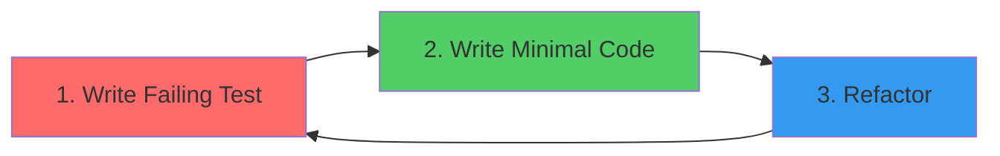

# Technology Stack

## Project Type
MCP Server (Model Context Protocol) - A Node.js CLI tool that implements the MCP specification to enable AI assistants to create and manage arc42 architecture documentation.

## Core Technologies

### Primary Language(s)
- **Language**: TypeScript 5.7
- **Runtime**: Node.js >= 24.0.0
- **Module System**: ES Modules (ESM) with Node16 module resolution
- **Build Target**: ES2022

### Key Dependencies/Libraries

#### Runtime Dependencies
- **@modelcontextprotocol/sdk ^1.24.3**: Official MCP SDK for building MCP servers, provides server implementation, transport protocols, and type definitions
- **zod ^3.25.36**: Runtime schema validation for tool input parameters
- **gray-matter ^4.0.3**: YAML front matter parsing for Markdown files
- **yaml ^2.3.4**: YAML configuration file parsing and serialization
- **chokidar ^3.5.3**: File system watcher (for potential future live-reload features)

#### Development Dependencies
- **typescript ^5.7.2**: TypeScript compiler
- **tsx ^4.7.0**: TypeScript execution for development and scripts
- **vitest ^4.0.15**: Test framework (Vite-based)
- **@vitest/coverage-v8 ^4.0.15**: Code coverage via V8
- **rimraf ^6.0.1**: Cross-platform file deletion

### Application Architecture
The project follows a **tool-based plugin architecture** where each MCP tool is implemented as a separate handler module. The main components are:

1. **MCP Server (Arc42MCPServer class)**: Central coordinator that:
   - Registers tools with the MCP SDK
   - Manages stdio transport for communication with AI clients
   - Handles lifecycle (initialization, graceful shutdown)

2. **Tool Handlers**: Individual modules for each arc42 operation:
   - `arc42-workflow-guide`: Documentation workflow guidance
   - `arc42-init`: Workspace initialization
   - `arc42-status`: Progress tracking
   - `generate-template`: Section template generation
   - `update-section`: Content updates
   - `get-section`: Content retrieval

3. **Templates & Localization**: Arc42 templates with multi-language support (11 languages) using the Strategy Pattern. Each language implements `LanguageStrategy` interface with localized section metadata and template content

4. **Types System**: Centralized type definitions for arc42 sections, responses, and contexts

### Data Storage
- **Primary storage**: File system (Markdown files)
- **Configuration**: YAML files (`config.yaml`)
- **Data formats**: 
  - Markdown for documentation content
  - JSON for MCP protocol messages
  - YAML for configuration and front matter

### External Integrations
- **Protocols**: MCP (Model Context Protocol) over STDIO
- **Client Communication**: JSON-RPC 2.0 via stdio streams
- **No authentication required**: Runs locally, trusts the host environment

## Development Environment

### Build & Development Tools
- **Build System**: npm scripts + TypeScript compiler
- **Package Management**: npm with package-lock.json
- **Key Commands**:
  - `npm run build`: Clean build with TypeScript compilation
  - `npm run dev`: Development mode with tsx
  - `npm test`: Run test suite
  - `npm run test:coverage`: Coverage report

### Code Quality Tools
- **Type Checking**: TypeScript strict mode with comprehensive checks:
  - `strict: true`
  - `noUnusedLocals`, `noUnusedParameters`
  - `noImplicitReturns`, `noFallthroughCasesInSwitch`
- **Testing Framework**: Vitest with V8 coverage
- **Coverage Thresholds**:
  - Statements: 80%
  - Branches: 75%
  - Functions: 90%
  - Lines: 80%

### Version Control & Collaboration
- **VCS**: Git with GitHub
- **Submodules**: arc42 template from official repository (`vendor/arc42-template`)
- **Branching Strategy**: GitHub Flow (main + feature branches)
- **CI/CD**: GitHub Actions for lint, test, and Docker builds

## Deployment & Distribution

### Target Platform(s)
- **Primary**: Local development environments
- **Supported OS**: macOS, Linux, Windows
- **Runs with**: Claude Desktop, Cursor, Cline, and other MCP-compatible tools

### Distribution Method
- **NPM Package**: `@h2nguyen/arc42-node-mcp-server`
- **NPX Support**: `npx -y @h2nguyen/arc42-node-mcp-server`
- **Docker**: Available via Dockerfile and docker-compose

### Installation Requirements
- Node.js >= 24.0.0
- npm for package management
- MCP-compatible AI client (Claude, Cursor, Cline)

### Update Mechanism
- npm package versioning with semver
- GitHub Releases for release notes

## Technical Requirements & Constraints

### Performance Requirements
- Fast tool response times (< 1 second for all operations)
- Minimal memory footprint for long-running MCP sessions
- Efficient file system operations for documentation management

### Compatibility Requirements
- **Platform Support**: Cross-platform (macOS, Linux, Windows)
- **Node.js**: >= 24.0.0 (using modern ESM features)
- **MCP Protocol**: Compatible with MCP SDK 1.24+

### Security & Compliance
- Runs locally with user file system permissions
- No network requests or external data transmission
- Documentation stored in plain text (auditable, versionable)

## Coding Best Practices

### S.O.L.I.D Principles

All code in this project SHALL adhere to the S.O.L.I.D principles:

#### Single Responsibility Principle (SRP)
- Each class/module SHALL have one and only one reason to change
- Tool handlers SHALL focus solely on handling tool requests
- Template providers SHALL only manage template retrieval
- File: One class/interface per file when the class is substantial
- **Example**: `LanguageRegistry` only manages language registration, not template loading

#### Open/Closed Principle (OCP)
- Code SHALL be open for extension but closed for modification
- New languages SHALL be added without modifying existing language implementations
- New tools SHALL be added without changing the server core
- Use interfaces and abstract classes to define extension points
- **Example**: New languages implement `LanguageStrategy` interface without touching registry code

#### Liskov Substitution Principle (LSP)
- Derived classes/implementations SHALL be substitutable for their base types
- All `LanguageStrategy` implementations SHALL behave consistently
- Mock implementations for testing SHALL behave like production implementations
- **Example**: `GermanStrategy` can replace `EnglishStrategy` anywhere `LanguageStrategy` is expected

#### Interface Segregation Principle (ISP)
- Interfaces SHALL be small and focused
- Clients SHALL not depend on methods they don't use
- Split large interfaces into smaller, role-specific ones
- **Example**: `TemplateProvider` and `LanguageStrategy` are separate interfaces, not one monolithic interface

#### Dependency Inversion Principle (DIP)
- High-level modules SHALL NOT depend on low-level modules; both SHALL depend on abstractions
- Tool handlers SHALL depend on `TemplateProvider` interface, not concrete implementations
- Use dependency injection for testability
- **Example**: `arc42-init` depends on `TemplateProvider` interface, not `LocalizedTemplateProvider` directly

### DRY (Don't Repeat Yourself)

All code in this project SHALL follow the DRY principle to reduce duplication and improve maintainability:

#### Core Concept
- Every piece of knowledge SHALL have a single, unambiguous, authoritative representation within a system
- Code duplication leads to inconsistencies, bugs, and maintenance burden
- When the same logic exists in multiple places, changes must be made everywhere (error-prone)

#### DRY Guidelines

| Guideline                   | Description                                                     | Example                                                   |
|-----------------------------|-----------------------------------------------------------------|-----------------------------------------------------------|
| **Single Source of Truth**  | Define data/logic in one place, reference it elsewhere          | Zod schemas defined in tool files, imported by server.ts  |
| **Extract Common Logic**    | Identify repeated code patterns and extract to shared functions | `getErrorMessage()` utility for consistent error handling |
| **Use Constants**           | Define magic values once as named constants                     | `SUPPORTED_LANGUAGE_CODES`, `ARC42_SECTIONS`              |
| **Parameterize Variations** | Use parameters instead of duplicating similar code              | Language strategies with configurable templates           |

#### DRY in Practice

**✅ Good - Single Source of Truth:**
```typescript
// Tool file defines schema once
export const arc42InitInputSchema = {
  projectName: z.string().describe('...'),
  language: z.enum(languageValues).optional().default('EN')
};

// Server imports and uses the same schema
import { arc42InitInputSchema } from './tools/arc42-init.js';
this.mcpServer.registerTool('arc42-init', {
  inputSchema: arc42InitInputSchema  // References single source
}, handler);
```

**❌ Bad - Duplicated Definitions:**
```typescript
// Tool file has one schema
const toolSchema = { projectName: z.string() };

// Server has duplicate schema (will get out of sync!)
const serverSchema = { projectName: z.string() };  // DUPLICATE!
```

#### When NOT to Apply DRY

DRY should not be applied blindly. Avoid premature abstraction:

- **Coincidental similarity**: Two pieces of code that look similar but serve different purposes may evolve differently
- **Over-abstraction**: Creating complex abstractions for simple one-time operations adds unnecessary complexity
- **Readability cost**: Sometimes a small amount of duplication is more readable than a complex shared abstraction

#### DRY Checklist

When writing new code:
- [ ] Is this logic already implemented elsewhere?
- [ ] Can I extract this into a shared utility/constant?
- [ ] If I change this, will I need to change it in multiple places?
- [ ] Is the abstraction worth the added complexity?

### Design Patterns

The project SHALL use established design patterns for maintainability, testability, and extensibility:

#### Creational Patterns

| Pattern       | Use Case                              | Implementation                                                       |
|---------------|---------------------------------------|----------------------------------------------------------------------|
| **Factory**   | Creating language strategy instances  | `LanguageFactory` creates strategies with normalization and fallback |
| **Singleton** | Global registry and factory instances | Registry, Factory, Provider as module-level singletons               |

#### Structural Patterns

| Pattern     | Use Case                       | Implementation                                                    |
|-------------|--------------------------------|-------------------------------------------------------------------|
| **Facade**  | Simplified template access     | `LocalizedTemplateProvider` facades complex language/config logic |
| **Adapter** | Wrapping external dependencies | Config reading adapts YAML library to internal interfaces         |

#### Behavioral Patterns

| Pattern             | Use Case                                 | Implementation                                             |
|---------------------|------------------------------------------|------------------------------------------------------------|
| **Strategy**        | Interchangeable language implementations | Each language is a `LanguageStrategy` implementation       |
| **Registry**        | Language catalog and discovery           | `LanguageRegistry` maintains available languages           |
| **Template Method** | Common tool handler structure            | Base patterns for request validation, processing, response |
| **Observer**        | Future: File change notifications        | Chokidar integration for live updates                      |

#### Pattern Selection Guidelines

When implementing new features:
1. **Adding new entities** → Consider Factory pattern for creation
2. **Adding variants/alternatives** → Consider Strategy pattern
3. **Adding lookup/discovery** → Consider Registry pattern
4. **Simplifying complex subsystems** → Consider Facade pattern
5. **Adapting external APIs** → Consider Adapter pattern

### Modularity & Reusability

#### Module Design Guidelines

- **Cohesion**: Group related functionality together
- **Coupling**: Minimize dependencies between modules
- **Encapsulation**: Hide implementation details behind interfaces
- **Composition**: Prefer composition over inheritance

#### File Organization for Reusability

```
src/
├── core/                    # Core abstractions (interfaces, base classes)
├── tools/                   # Tool implementations (one per file)
├── templates/
│   └── locales/            # Language strategies (one folder per language)
├── utils/                   # Shared utilities (pure functions)
└── types.ts                # Type definitions (shared across modules)
```

#### Reusability Checklist

When creating new code:
- [ ] Can this function/class be used in multiple contexts?
- [ ] Are dependencies injected rather than hardcoded?
- [ ] Is the interface minimal and focused?
- [ ] Are implementation details hidden?
- [ ] Can this be tested in isolation?

### Test-Driven Development (TDD)

The project SHALL follow TDD practices for new feature development:

#### TDD Cycle (Red-Green-Refactor)



1. **Red**: Write a failing test that defines the expected behavior
2. **Green**: Write the minimum code to make the test pass
3. **Refactor**: Improve the code while keeping tests green

#### TDD Guidelines

- **Test First**: Write tests before implementation for new features
- **Small Steps**: Each test should test one specific behavior
- **Fast Feedback**: Unit tests should run in milliseconds
- **Isolation**: Tests should not depend on external systems or other tests

#### Test Categories

| Category        | Purpose                           | Speed   | Location                  |
|-----------------|-----------------------------------|---------|---------------------------|
| **Unit**        | Test individual functions/classes | < 10ms  | `src/__tests__/{module}/` |
| **Integration** | Test module interactions          | < 100ms | `src/__tests__/tools/`    |
| **E2E**         | Test complete workflows           | < 5s    | `tests/e2e/` (future)     |

#### Test Structure (AAA Pattern)

```typescript
describe('LanguageFactory', () => {
  describe('create', () => {
    it('should return German strategy for "DE" code', () => {
      // Arrange
      const factory = new LanguageFactory(registry);
      
      // Act
      const strategy = factory.create('DE');
      
      // Assert
      expect(strategy.code).toBe('DE');
      expect(strategy.name).toBe('German');
    });
  });
});
```

#### Mocking Strategy

- **Dependencies**: Mock external dependencies (file system, network)
- **Interfaces**: Mock interfaces for isolated testing
- **Minimal Mocks**: Only mock what's necessary for the test
- **Vitest Mocks**: Use `vi.mock()` and `vi.spyOn()` for mocking

#### Coverage Goals

| Metric     | Minimum | Target |
|------------|---------|--------|
| Statements | 80%     | 90%    |
| Branches   | 75%     | 85%    |
| Functions  | 90%     | 95%    |
| Lines      | 80%     | 90%    |

### Code Quality Standards

#### TypeScript Best Practices

- **Strict Mode**: Always enable strict TypeScript checks
- **Explicit Types**: Prefer explicit types over inference for public APIs
- **No `any`**: Avoid `any`; use `unknown` with type guards instead
- **Readonly**: Use `readonly` for immutable data
- **Const Assertions**: Use `as const` for literal types
- **Explicit Imports**: Use named imports instead of star imports (`import * as`)
  - ✅ Good: `import { LanguageRegistry, LanguageFactory } from './templates/index.js';`
  - ❌ Bad: `import * as templates from './templates/index.js';`
- **Absolute Path Imports**: Prefer absolute paths over relative paths for better maintainability
  - ✅ Good: `import { ToolContext } from '../types.js';` (from project root)
  - ❌ Avoid: `import { ToolContext } from '../../../../../../types.js';` (deep relative paths)
  - Configure `baseUrl` and `paths` in tsconfig.json for cleaner imports when needed

#### Naming Conventions

| Element    | Convention                | Example                |
|------------|---------------------------|------------------------|
| Interfaces | PascalCase, no "I" prefix | `LanguageStrategy`     |
| Types      | PascalCase                | `Arc42Section`         |
| Classes    | PascalCase                | `LanguageRegistry`     |
| Functions  | camelCase                 | `createStrategy()`     |
| Constants  | UPPER_SNAKE_CASE          | `ARC42_SECTIONS`       |
| Files      | kebab-case                | `language-strategy.ts` |

#### Error Handling

- **Typed Errors**: Create specific error classes for different failure modes
- **Error Messages**: Include context in error messages
- **Fail Fast**: Validate inputs early and fail with clear messages
- **Recovery**: Provide fallback behavior where appropriate

## Technical Decisions & Rationale

### Decision Log

1. **TypeScript over JavaScript**: Chosen for type safety, better IDE support, and maintainability in a tool that generates structured content
   
2. **ES Modules over CommonJS**: Modern module system aligns with Node.js direction, enables better tree-shaking and static analysis

3. **Zod for Schema Validation**: Provides runtime validation with TypeScript type inference, ensuring tool inputs match expected schemas

4. **File-based Documentation**: Markdown files enable version control, diff-friendly content, and platform independence vs database storage

5. **STDIO Transport**: Standard MCP transport mechanism, enables simple integration with any MCP client without networking complexity

6. **Vitest over Jest**: Faster execution, native ESM support, simpler configuration for TypeScript projects

## Known Limitations

- **Node.js 24+ requirement**: Limits usage to environments with latest Node.js (needed for native ESM features)
- **Single-user design**: No built-in multi-user collaboration or conflict resolution
- **No diagram rendering**: Mermaid/PlantUML diagrams stored as text, rendering left to documentation viewers
- **Markdown-only output**: Documentation output is currently limited to Markdown format (AsciiDoc and other formats are potential future enhancements)
