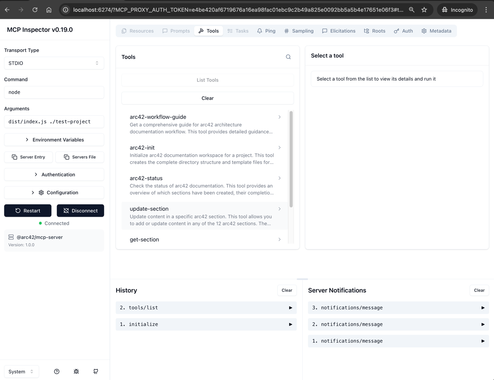

# Arc42 Node MCP Server

> **AI-Assisted Architecture Documentation following the arc42 Template**

A Model Context Protocol (MCP) server that helps you create comprehensive architecture documentation using the proven arc42 template. Perfect for AI-assisted documentation with Claude, Cursor, Cline and other MCP-compatible tools.

[](https://opensource.org/licenses/Apache-2.0)
[](https://www.typescriptlang.org/)
[](https://modelcontextprotocol.io/)

## Table of Content

<!-- TOC -->
* [📋 What is arc42?](#-what-is-arc42)
  * [arc42 Template Reference](#arc42-template-reference)
    * [Updating to Latest arc42 Template](#updating-to-latest-arc42-template)
* [🚀 Quick Start](#-quick-start)
  * [Installation](#installation)
  * [Setup in Claude Desktop](#setup-in-claude-desktop)
  * [Setup in Cursor](#setup-in-cursor)
  * [Setup in Cline](#setup-in-cline)
  * [Understanding Workspace Configuration](#understanding-workspace-configuration)
    * [Option 1: Default Workspace Path (Server Startup Argument)](#option-1-default-workspace-path-server-startup-argument)
    * [Option 2: Dynamic targetFolder Parameter (Per-Tool Override)](#option-2-dynamic-targetfolder-parameter-per-tool-override)
    * [Recommendation](#recommendation)
  * [First Steps](#first-steps)
* [🛠️ Available Tools](#-available-tools)
  * [arc42-workflow-guide](#arc42-workflow-guide)
  * [arc42-init](#arc42-init)
  * [arc42-status](#arc42-status)
  * [generate-template](#generate-template)
  * [update-section](#update-section)
  * [get-section](#get-section)
* [📚 The 12 arc42 Sections](#-the-12-arc42-sections)
* [📖 Usage Examples](#-usage-examples)
  * [Example 1: Starting Fresh](#example-1-starting-fresh)
  * [Example 2: Document Specific Section](#example-2-document-specific-section)
  * [Example 3: Add Architecture Decision](#example-3-add-architecture-decision)
* [🏗️ Project Structure](#-project-structure)
* [🎯 Best Practices](#-best-practices)
  * [For AI Assistants](#for-ai-assistants)
  * [For Users](#for-users)
* [🔧 Development](#-development)
  * [Building from Source](#building-from-source)
  * [Running in Development Mode](#running-in-development-mode)
* [🧪 Testing](#-testing)
  * [Running Tests](#running-tests)
  * [Test Structure](#test-structure)
  * [Coverage Thresholds](#coverage-thresholds)
  * [Test Categories](#test-categories)
  * [CI/CD Pipeline](#cicd-pipeline)
* [🐳 Docker Support](#-docker-support)
  * [Building the Docker Image](#building-the-docker-image)
  * [Running with Docker](#running-with-docker)
  * [Using Docker Compose](#using-docker-compose)
  * [Testing with MCP Inspector standalone (Recommended)](#testing-with-mcp-inspector-standalone-recommended)
  * [Docker Compose Services](#docker-compose-services)
  * [Testing Workflow](#testing-workflow)
* [🤝 Contributing](#-contributing)
* [📄 License](#-license)
* [🙏 Acknowledgments](#-acknowledgments)
* [📞 Support](#-support)
* [🔗 Links](#-links)
<!-- TOC -->

## 📋 What is arc42?

[arc42](https://arc42.org/) is a template for architecture communication and documentation. It provides a clear structure for documenting software and system architectures, making them understandable for all stakeholders.

This MCP server brings arc42 to the age of AI-assisted development, allowing you to:
- 🤖 Generate architecture documentation with AI assistance
- 📊 Follow the proven structure across twelve well-defined sections
- ✅ Track documentation progress and completeness
- 🔄 Maintain consistent, up-to-date architecture docs
- 🌍 Share knowledge across worldwide development teams

### arc42 Template Reference

This MCP server dynamically reads version information from the **arc42 template git submodule** at runtime.

| Property       | Value                                                           |
|----------------|-----------------------------------------------------------------|
| Source         | [arc42/arc42-template](https://github.com/arc42/arc42-template) |
| Submodule Path | `vendor/arc42-template`                                         |
| Version File   | `vendor/arc42-template/EN/version.properties`                   |

> **Note**: The templates in this server are adapted from AsciiDoc to Markdown format with guidance text customized for AI-assisted documentation.

To display the current arc42 template version:

```bash
npm run show:arc42-version
```

#### Updating to the Latest arc42 Template

This project uses a **dynamic version loading approach**:
- **Git submodule** (`vendor/arc42-template`) provides the upstream template
- **Version info is read dynamically** from `vendor/arc42-template/EN/version.properties` at runtime
- **No hardcoded values** - the version always reflects the checked-out submodule state

To update to the latest arc42 template version:

```bash
# Update submodule and display new version
npm run update:arc42

# Or manually:
npm run submodule:update       # Pull latest from upstream
npm run show:arc42-version     # Display new version info

# Review and test
npm test                       # Ensure tests pass
git diff                       # Review changes
git add vendor/arc42-template  # Stage submodule update
```

For contributors cloning the repo, initialize the submodule:

```bash
git clone --recurse-submodules https://github.com/h2nguyen/Arc42-Node-MCP-Server.git
# Or after cloning:
npm run submodule:init
```

> **Note for npm package users**: The submodule is not included in the npm package. Fallback values are used when the submodule is unavailable.

## 🚀 Quick Start

### Installation

```bash
# Install latest version
npm install -g @h2nguyen/arc42-node-mcp-server

# Install specific version
npm install -g @h2nguyen/arc42-node-mcp-server@1.0.2
```

### Setup in Claude Desktop

Add to your Claude configuration file:

- **macOS**: `~/Library/Application Support/Claude/claude_desktop_config.json`
- **Windows**: `%APPDATA%\Claude\claude_desktop_config.json`

```json
{
  "mcpServers": {
    "arc42-mcp-server": {
      "command": "arc42-mcp",
      "args": ["/path/to/your/project"]
    }
  }
}
```

### Setup in Cursor

Add to your MCP settings in Cursor:

```json
{
  "mcpServers": {
    "arc42-mcp-server": {
      "command": "arc42-mcp",
      "args": ["${workspaceFolder}"]
    }
  }
}
```

### Setup in Cline

Add to your Cline MCP settings file (`~/.cline/data/settings/cline_mcp_settings.json`):

**Using npm package (recommended):**

```json
{
  "mcpServers": {
    "arc42-mcp-server": {
      "disabled": false,
      "timeout": 60,
      "type": "stdio",
      "command": "arc42-mcp",
      "args": ["/path/to/your/project"],
      "autoApprove": [
        "arc42-workflow-guide",
        "arc42-init",
        "arc42-status",
        "update-section",
        "generate-template",
        "get-section"
      ]
    }
  }
}
```

**Using local build:**

```json
{
  "mcpServers": {
    "arc42-mcp-server": {
      "disabled": false,
      "timeout": 60,
      "type": "stdio",
      "command": "node",
      "args": [
        "/path/to/your/local/build/e.g./Arc42-Node-MCP-Server/dist/index.js"
      ],
      "autoApprove": [
        "arc42-workflow-guide",
        "arc42-init",
        "arc42-status",
        "update-section",
        "generate-template",
        "get-section"
      ]
    }
  }
}
```

### Understanding Workspace Configuration

The arc42 MCP server needs to know **where to create and manage documentation files**. There are two ways to configure this:

#### Option 1: Default Workspace Path (Server Startup Argument)

When starting the MCP server, you can provide a default workspace path as a command line argument:

```bash
node dist/index.js /path/to/my-project
```

This sets `/path/to/my-project` as the default location. The server will create documentation at `/path/to/my-project/arc42-docs/`.

**In MCP configurations:**
- Claude Desktop: `"args": ["/path/to/your/project"]`
- Cursor: `"args": ["${workspaceFolder}"]` (dynamically uses the current project)
- Cline: `"args": ["/path/to/dist/index.js", "/path/to/default/project"]`

If no path is provided, the server uses the current working directory (`process.cwd()`).

#### Option 2: Dynamic targetFolder Parameter (Per-Tool Override)

Each tool call can include an optional `targetFolder` parameter to override the default workspace:

```json
arc42-init {
  "projectName": "My Project",
  "targetFolder": "/Users/me/another-project"
}
```

This is useful when:
- You want to work with multiple projects without reconfiguring the server
- You're using Cline/other AI assistants where workspace context may vary
- You want the AI agent to dynamically choose where to write documentation

**Priority**: `targetFolder` parameter (if provided) > Server startup argument > Current working directory

#### Recommendation

| Use Case                   | Recommendation                           |
|----------------------------|------------------------------------------|
| Single project focus       | Set default path in server args          |
| Multi-project workflow     | Use `targetFolder` parameter dynamically |
| IDE with workspace support | Use `${workspaceFolder}` variable        |
| Cline/AI agents            | Omit default path, use `targetFolder`    |

### First Steps

1. **Start with the guide**: Ask your AI assistant to run `arc42-workflow-guide`
2. **Initialize documentation**: Use `arc42-init` with your project name
3. **Check status**: Run `arc42-status` to see your progress
4. **Generate templates**: Use `generate-template` for specific sections
5. **Document iteratively**: Use `update-section` to add content

## 🛠️ Available Tools

### arc42-workflow-guide
Load the complete arc42 documentation workflow guide with instructions for all 12 sections.

```typescript
// No parameters required
arc42-workflow-guide
```

### arc42-init
Initialize arc42 documentation workspace for your project.

```typescript
arc42-init {
  projectName: "Your Project Name",
  force?: false,  // Re-initialize even if exists
  targetFolder?: "/path/to/project"  // Optional: specify target directory
}
```

### arc42-status
Check the status of your documentation, including completion percentage and section details.

```typescript
arc42-status {
  targetFolder?: "/path/to/project"  // Optional: specify target directory
}
```

### generate-template
Generate a detailed template for any of the 12 arc42 sections.

```typescript
generate-template {
  section: "01_introduction_and_goals" | "02_architecture_constraints" | ...
}
```

### update-section
Update content in a specific arc42 section.

```typescript
update-section {
  section: "01_introduction_and_goals",
  content: "# Your markdown content here",
  mode?: "replace" | "append",
  targetFolder?: "/path/to/project"  // Optional: specify target directory
}
```

### get-section
Read content from a specific arc42 section.

```typescript
get-section {
  section: "01_introduction_and_goals",
  targetFolder?: "/path/to/project"  // Optional: specify target directory
}
```

## 📚 The 12 arc42 Sections

1. **Introduction and Goals** - Requirements, quality goals, stakeholders
2. **Architecture Constraints** - Technical and organizational constraints
3. **Context and Scope** - Business and technical context
4. **Solution Strategy** - Fundamental decisions and strategies
5. **Building Block View** - Static decomposition of the system
6. **Runtime View** - Dynamic behavior and scenarios
7. **Deployment View** - Infrastructure and deployment
8. **Cross-cutting Concepts** - Overall regulations and approaches
9. **Architecture Decisions** - Important decisions (ADRs)
10. **Quality Requirements** - Quality tree and scenarios
11. **Risks and Technical Debt** - Known problems and risks
12. **Glossary** - Important terms

## 📖 Usage Examples

### Example 1: Starting Fresh

```
You: "Help me create architecture documentation for my e-commerce platform"

AI runs: arc42-workflow-guide
AI runs: arc42-init { projectName: "E-Commerce Platform" }
AI runs: generate-template { section: "01_introduction_and_goals" }

AI: "Let's start with Section 1. What are your top 3 quality goals?"
```

### Example 2: Document Specific Section

```
You: "Document the deployment architecture - we use AWS with ECS"

AI runs: generate-template { section: "07_deployment_view" }
AI creates content with your AWS/ECS details
AI runs: update-section { 
  section: "07_deployment_view",
  content: "..." 
}
AI runs: arc42-status
```

### Example 3: Add Architecture Decision

```
You: "Document why we chose PostgreSQL over MongoDB"

AI runs: generate-template { section: "09_architecture_decisions" }
AI creates ADR with context, decision, and consequences
AI runs: update-section { 
  section: "09_architecture_decisions",
  content: "...",
  mode: "append"
}
```

## 🏗️ Project Structure

After initialization, your project will have:

```
your-project/
└── arc42-docs/
    ├── README.md                    # Getting started guide
    ├── arc42-template.md            # Main combined document
    ├── config.yaml                  # Configuration
    ├── images/                      # Diagrams and images
    └── sections/                    # Individual section files
        ├── 01_introduction_and_goals.md
        ├── 02_architecture_constraints.md
        ├── 03_context_and_scope.md
        ├── 04_solution_strategy.md
        ├── 05_building_block_view.md
        ├── 06_runtime_view.md
        ├── 07_deployment_view.md
        ├── 08_concepts.md
        ├── 09_architecture_decisions.md
        ├── 10_quality_requirements.md
        ├── 11_technical_risks.md
        └── 12_glossary.md
```

## 🎯 Best Practices

### For AI Assistants

1. **Always start with the guide**: Run `arc42-workflow-guide` to understand the structure
2. **Check status regularly**: Use `arc42-status` to track progress
3. **One section at a time**: Focus on completing one section before moving to the next
4. **Use diagrams**: Generate Mermaid/PlantUML diagrams in the content
5. **Ask clarifying questions**: Don't assume - ask the user for specific details

### For Users

1. **Start with Section 1**: Always begin with Introduction and Goals
2. **Be iterative**: You don't need to complete all sections immediately
3. **Focus on decisions**: Document WHY, not just WHAT
4. **Keep it current**: Update as architecture evolves
5. **Use version control**: Commit your arc42-docs directory to Git

## 🔧 Development

### Building from Source

```bash
git clone https://github.com/h2nguyen/Arc42-Node-MCP-Server.git
cd Arc42-Node-MCP-Server
npm install
npm run build
```

### Running in Development Mode

```bash
npm run dev /path/to/your/project
```

## 🧪 Testing

This project maintains high-quality standards with a comprehensive test suite using [Vitest](https://vitest.dev/).

### Running Tests

```bash
# Run all tests
npm test

# Run tests with coverage
npm run test:coverage

# Run tests in watch mode
npm run test:watch
```

### Test Structure

```
src/__tests__/
├── fixtures/
│   └── test-helpers.ts     # Shared test utilities and constants
├── templates/
│   └── index.test.ts       # Tests for all twelve arc42 templates
├── tools/
│   └── arc42-init.test.ts  # Tests for the arc42-init tool
└── types.test.ts           # Tests for types and constants
```

### Coverage Thresholds

The project enforces minimum coverage thresholds to maintain quality:

| Metric     | Threshold |
|------------|-----------|
| Statements | 70%       |
| Branches   | 60%       |
| Functions  | 70%       |
| Lines      | 70%       |

### Test Categories

- **Unit Tests**: Core functions, type helpers, and constants
- **Template Tests**: All twelve arc42 section templates for structure and guidance content
- **Tool Tests**: MCP tool definitions and execution behavior
- **Error Handling**: Invalid inputs, edge cases, and graceful failure

### CI/CD Pipeline

The GitHub Actions workflow runs automatically on pull requests and pushes:

- **Lint**: TypeScript type checking and ESLint
- **Test**: Multi-version Node.js matrix (22, 24) with coverage reporting
- **Docker**: Container build verification
- **Security**: npm audit for vulnerability scanning

## 🐳 Docker Support

### Building the Docker Image

```bash
docker build -t arc42-node-mcp-server .
```

### Running with Docker

```bash
# Run with a mounted project directory
docker run -v /path/to/project:/project arc42-node-mcp-server

# Interactive mode
docker run -it -v /path/to/project:/project arc42-node-mcp-server
```

### Using Docker Compose

Docker Compose provides convenient setups for development and testing:

```bash
# Build the container
docker compose build

# Run the MCP server
docker compose run --rm arc42-node-mcp-server

# Run in development mode with live reload
docker compose up dev
```

### Testing with MCP Inspector standalone (Recommended)

The [MCP Inspector](https://github.com/modelcontextprotocol/inspector) provides a web-based UI for testing MCP servers.

> 📖 **Detailed Guide**: See [docs/mcp-inspector-testing.md](docs/mcp-inspector-testing.md) for complete step-by-step instructions.

**Quick Start with npx (Recommended):**

```bash
# Build the project
npm run build

# Start MCP Inspector with the arc42 server
npx @modelcontextprotocol/inspector node dist/index.js ./test-project
```

Then open **http://localhost:6274** in your browser.

**Using Docker Compose:**

```bash
# Prerequisites: Build the project first
npm run build

# Create a test directory
mkdir -p test-project

# Start MCP Inspector with the arc42 server
docker compose up mcp-inspector
```

Then open **http://localhost:6274** in your browser. The server should **auto-connect**, and you'll see the six arc42 tools in the "Tools" tab, see the following screenshot:



> **Note**: If auto-connect doesn't work, manually configure using **container paths**:
> - Command: `node`
> - Arguments: `/app/dist/index.js /project`
>
> ⚠️ Do NOT use local paths like `/Users/yourname/...` - these don't exist inside the Docker container.

**Configuring MCP Inspector Manually (Standalone):**

If running MCP Inspector standalone (not via Docker), configure these settings with your **local absolute paths**:

| Field          | Value                                                    |
|----------------|----------------------------------------------------------|
| Transport Type | `STDIO`                                                  |
| Command        | `node`                                                   |
| Arguments      | `/full/path/to/dist/index.js /full/path/to/test-project` |

Click **Connect** to start testing the tools.

The Inspector allows you to:
- Browse available tools (`arc42-workflow-guide`, `arc42-init`, `arc42-status`, etc.)
- Execute tools with custom parameters
- Inspect request/response payloads
- Test the complete MCP protocol interaction

### Docker Compose Services

| Service                 | Description                        | Usage                                                     |
|-------------------------|------------------------------------|-----------------------------------------------------------|
| `arc42-node-mcp-server` | Production-ready container         | `docker compose run --rm arc42-node-mcp-server`           |
| `mcp-inspector`         | MCP Inspector with stdio transport | `docker compose up mcp-inspector` → http://localhost:6274 |
| `dev`                   | Development mode with live reload  | `docker compose up dev`                                   |

### Testing Workflow

```bash
# 1. Create a test project directory
mkdir -p test-project

# 2. Build the project
npm run build

# 3. Start MCP Inspector
docker compose up mcp-inspector

# 4. Open browser at http://localhost:6274

# 5. Test tools:
#    - Call arc42-workflow-guide (no params)
#    - Call arc42-init with {"projectName": "Test Project"}
#    - Call arc42-status (no params)
#    - Call generate-template with {"section": "01_introduction_and_goals"}
```

## 🤝 Contributing

We welcome contributions! This project serves architecture documentation needs worldwide.

1. Fork the repository
2. Create your feature branch (`git checkout -b feature/amazing-feature`)
3. Commit your changes (`git commit -m 'Add amazing feature'`)
4. Push to the branch (`git push origin feature/amazing-feature`)
5. Open a Pull Request

See [CONTRIBUTING.md](CONTRIBUTING.md) for detailed guidelines.

## 📄 License

This project is licensed under the Apache License 2.0 – see the [LICENSE](LICENSE) file for details.

**Note about arc42**: This MCP server uses material from the arc42 architecture template (https://arc42.org and https://github.com/arc42/arc42-template). The arc42 template was created by [Dr. Gernot Starke](https://github.com/gernotstarke) and [Dr. Peter Hruschka](https://github.com/Hruschka) and is licensed under Creative Commons Attribution-ShareAlike 4.0 International License (CC BY-SA 4.0).

- For software code attributions, see [NOTICE](NOTICE).
- For the full arc42 license terms, see [LICENSE-ARC42](LICENSE-ARC42).

## 🙏 Acknowledgments

- [arc42](https://arc42.org/) - The proven, practical, and pragmatic architecture template
- [Dr. Gernot Starke](https://github.com/gernotstarke) and [Dr. Peter Hruschka](https://github.com/Hruschka) - Creators of arc42
- [Model Context Protocol](https://modelcontextprotocol.io/) - The protocol enabling AI tool use

## 📞 Support

- **Issues**: [GitHub Issues](https://github.com/h2nguyen/Arc42-Node-MCP-Server/issues)

## 🔗 Links

- **arc42 Website**: https://arc42.org/
- **arc42 Documentation**: https://docs.arc42.org/
- **arc42 GitHub**: https://github.com/arc42
- **arc42 Examples**: https://arc42.org/examples (Additional examples are embedded within the documentation at https://docs.arc42.org/)
- **arc42 FAQ**: https://faq.arc42.org/
- **arc42 Node MCP Server Github**: https://github.com/h2nguyen/Arc42-Node-MCP-Server
- **MCP Specification**: https://modelcontextprotocol.io/specification/

---

**Built with ❤️ for the global software architecture community**

[](https://arc42.org/)
[](https://modelcontextprotocol.io/)
